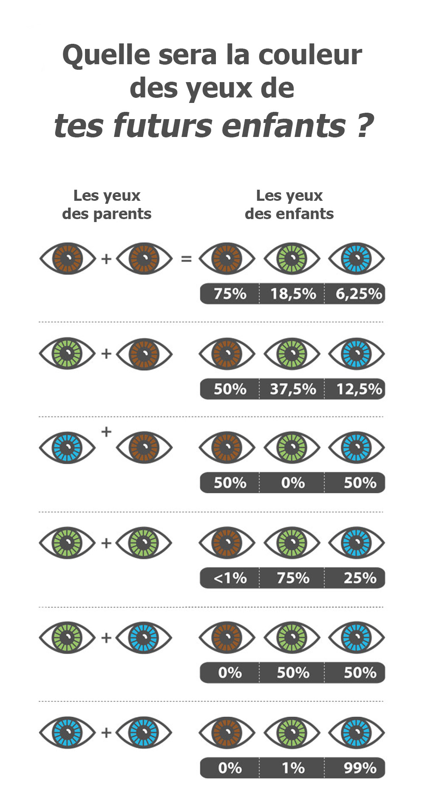
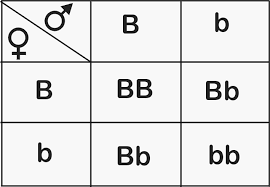

# projet_mutation_aliens
### Hugo Guiraud et Aymée Bonvarlet
A remettre avant le 24 décembre 2020
## Appréhension du sujet 

On va créer un programme donnant la possibilité à une population de connaître le meilleur individu après X générations. Ainsi définir un fitness adapter en fonction des gènes qui nous intéresserons. 
On classera après chaque génération par ordre croissant les individus obtenues. 
Ainsi l'individu ayant obtenu le fitness le plus bas ne sera pas utilisé pour créer la prochaine génération. A contrario l'individu ayant obtenu le meilleur fitness sera quant à lui, utilisé deux fois pour la prochaine génération afin de compenser ce dernier. 

Chaque génération comporte 7 individus non genré puisque se sont des aliens capables d'adapter leur sexe.

Chaque gène pourra muter avec la propabilité de 25%.

gène 1 : allèle schtroumpf récessif (+) (être bleu c'est cool)
gène 2 : taille tantacules (+) (+ nbre de ventouse?)
gène 3 : allèle strabisme récessif (-) (être trop différent c'est chiant)

-> tenir compte de l'environnement ext
-> selection naturelle

étape 1 : appréhender TSP et Labyrinthe, commenter les éléments dont nous nous resservirons afin d'utiliser la même méthode.
étape 2 : créer un fichier BOUML afin de bien définir nos fonctions.
étape 3 :  programmer le code avec un gène sur Qt
étape 4 :  incorporer les autres gènes au projet Qt
étape 5 : graphique si temps

 

 
-> échéquier de punnett

Pour définir l'importance de chacun des fitness des gênes lors du calcul du fitness général de l'alien, on définira des paramètre de manère arbitraire et on établira une note globale

pour le gène Schtroupf :

on part sur 3 couleurs :

rouge dominant (60%)
vert récessif (35%)
bleu récessif (5%)

vb donne jaune (Cette modification apparaitra seulement sur le graphique, les gênes resteront "vb"(pour vert et bleu) et ne deviendrons pas "jj")
donc on aura au total 4 couleurs possibles pour notre alien : Rouge, vert, bleu et jaune. Mais l'alien bleu aura le meilleur fitness et le rouge le moins bon.

Pour le grêne tentaclessize :

On part pour l'instant sur 3 tailles de tentacle : 

Grande tentacules 
Moyennes tentacules
Petites tentacules

On donc 3 tailles de tentacules pour notre alien, sachant que celui avec les plus grandes tentacules aura un meilleure fitness que celui avec les petites

à faire: simulation d'une seule génération d'alien, donc à essayer: faire 2 parents et choisir la bonne transmission des gènes

à rendre le 24/12/20

1 -  IA projet génétique
    -> git
    -> pdf 
    >explicatif 
    >methode de raccrochage à l'algorithme : gène -> génome -> individu -> population -> test unitaires
    console -> zoom sur section +  explication 